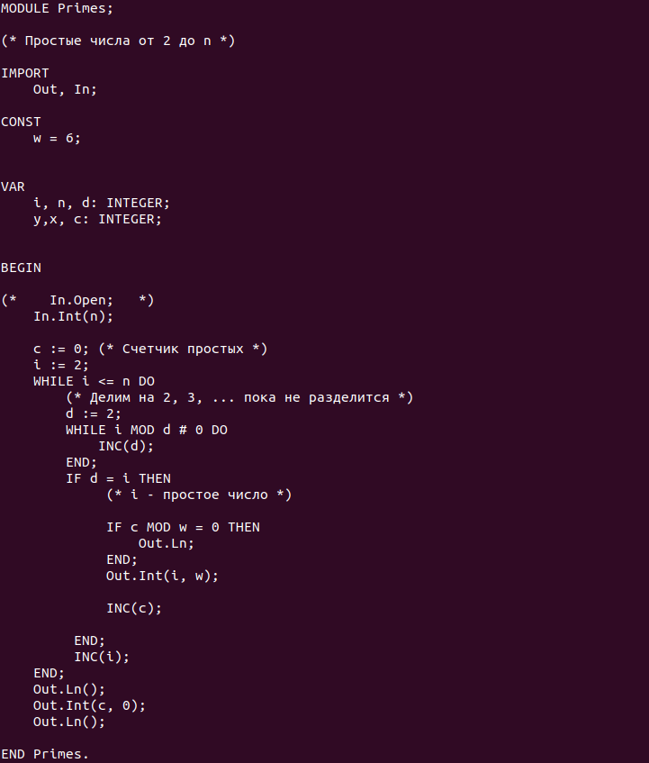
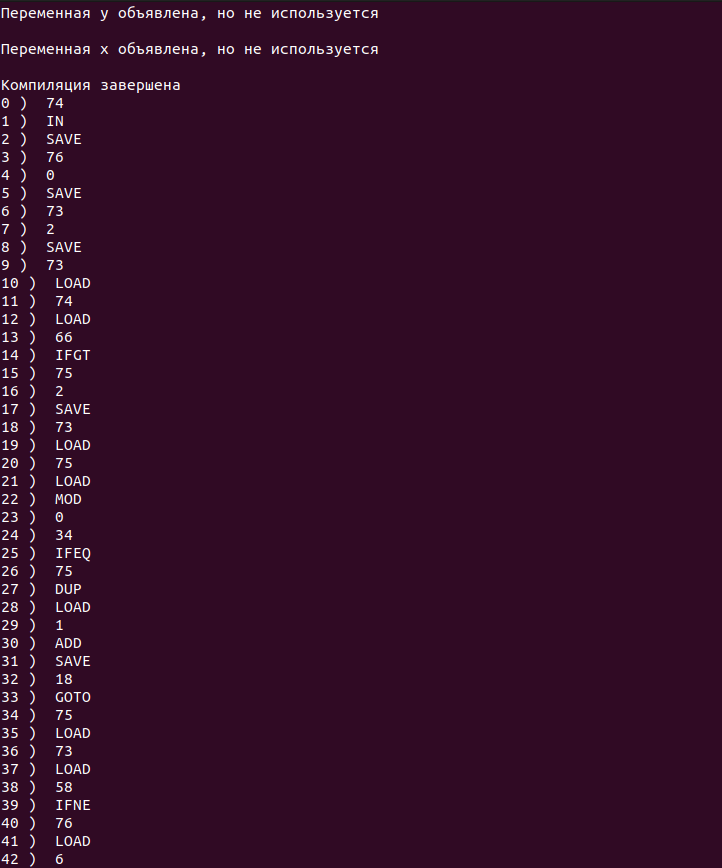
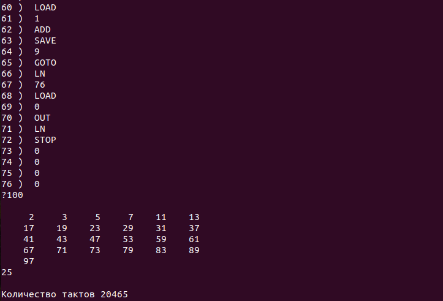

# Компилятор языка Oberon

Пример исходного кода на языке Oberon:

Результат работы компилятора - программа на языке ассемблера стековой виртуальной машины:

Резудьтат работы программы - программа считает простые числа от 0 до n:

Компилирует программу из исходного текста на языке Oberon в машинный код собственной виртуальной машины.
Однопроходный алгоритм без оптимизации кода.

Содержит:
- драйвер исходного текста
- лексический анализатор
- контекстный анализатор
- генератор машинного кода
- стековую виртуальную машину

Служит прототипом для разработки компилятора языка C для собственного процессора 8-bit AON Computer.

Написан на Python.

Статус проекта: Завершен.

Copyright (c) разработан по методике Свердлова С.З.  
2022-2023 Evgeny Goryachev  
Gor.Com
